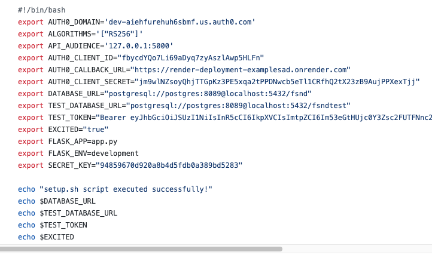
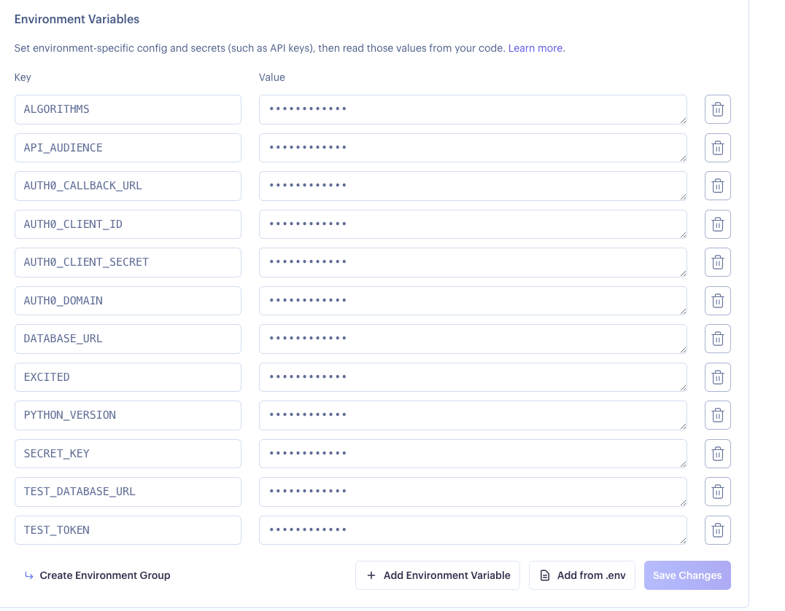

# FSND Captone Project

It's a Full stack ND project by Udacity. project is based on casting agency which allow user to CREATE, UPDATE, READ, DELETE of Actors and Movies.


**Environment Setup**

**Local**

```
# Change to project folder
cd Path user/udacity/project etc
```

**Initialize and activate a virtualenv using:**
```
# Mac Users

python3.8 -m venv env
source env/bin/activate
```
**Install the dependencies:**
```
# run all required dependencies

pip3.8 install -r requirements.txt

# if any updates or install new dependencies so use this command to for updates the requirements.txt file.  

pip3.8 freeze > requirements.txt
```

```
chmod +x setup.sh
source setup.sh
echo $DATABASE_URL
echo $TEST_DATABASE_URL
echo $EXCITED
```

**Run the development server:**

### Local

Main Project

```
export FLASK_APP=app.py;
export FLASK_ENV=development # enables debug mode
flask run --reload
```

Test Project

```
python3.8 test_app.py
```

### Render(Cloud)


**Setup Roles on Auth0:**

- Casting Assistant

	- Can view actors and movies

- Casting Director

	- All permissions a Casting Assistant has and…
	- Add or delete an actor from the database
	- Modify actors or movies

- Executive Producer

	- All permissions a Casting Director has and…
	- Add or delete a movie from the database

**Set Permissions:**

    - `delete:actors`
    - `delete:movies`
    - `get:actors`
    - `get:movies`
    - `patch:actors`
    - `patch:movies`
    - `post:actors`
    - `post:movies`

**Set up Render PostgreSQL**

- Create New PostgreSQL
- Once created copy `Internal database URL`

**Set up Render Web Service**

- Connect with Github project repo.
- Set up Environment like python version 3.8.12, excited true and database URL - paste the internal database url
- hit create button

**Set up token from auth0**

- once the render is live then only you can get token, now render is live so we go for token. 
- Update the callback url,logout url,web orgin, allowed orgins cors on application which we can copy from render web service url link and hit save button

```
https://{{YOUR_DOMAIN}}/authorize?audience={{API_IDENTIFIER}}&response_type=token&client_id={{YOUR_CLIENT_ID}}&redirect_uri={{YOUR_CALLBACK_URI}}

Example:
https://dev-aiehfurehuh6sbmf.us.auth0.com/authorize?audience=127.0.0.1:5000&response_type=token&client_id=fbycdYQo7Li69aDyq7zyAszlAwp5HLFn
&redirect_uri=https://render-deployment-examplesad.onrender.com
```

**Set up render Environment and setup.sh final step for deployment**




